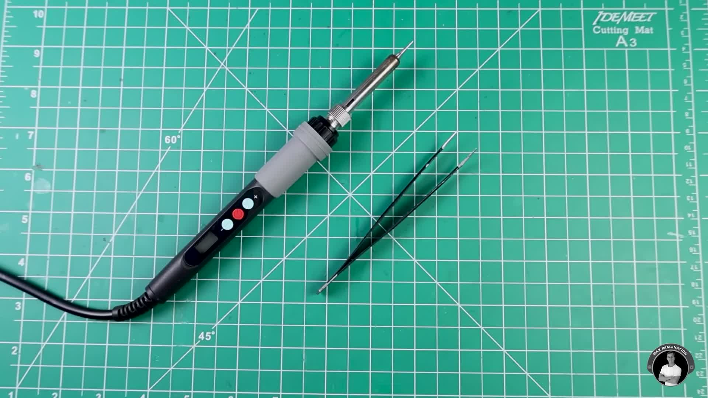
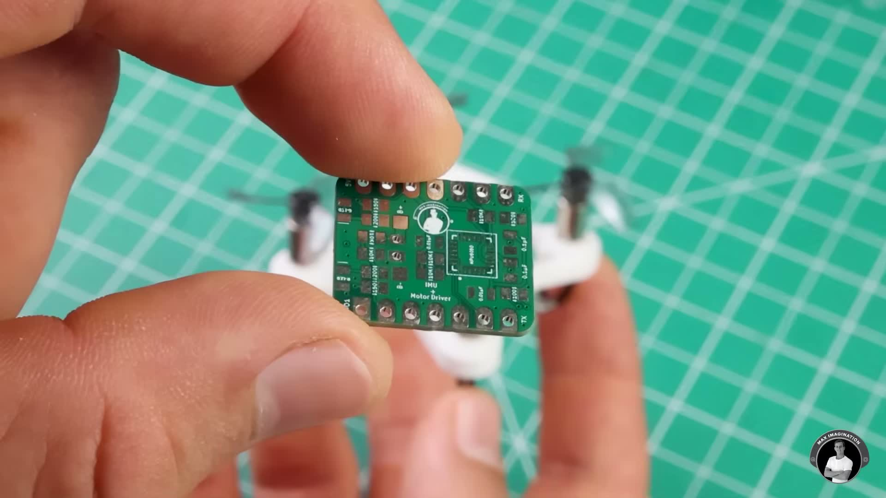
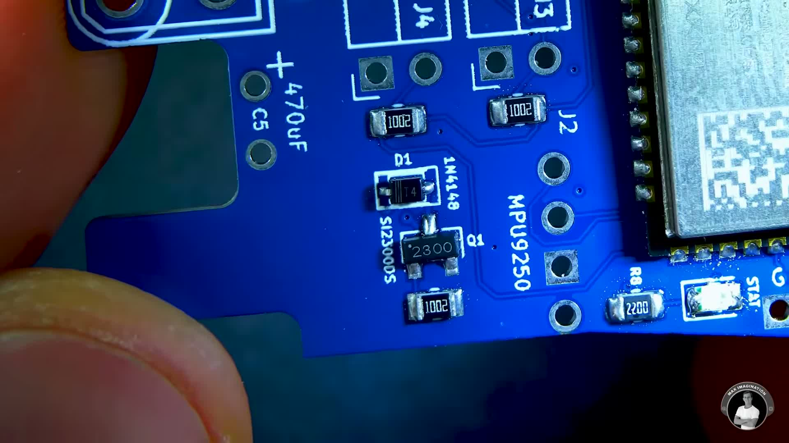

# vidcontext

Real transcription and real screenshot extraction from YouTube videos or
local video/audio files — built to be used **by an AI agent**, not to
replace one.

`vidcontext` calls no AI API itself. It does the mechanical, deterministic
work:

- **Transcript**: real subtitles when available (YouTube manual → YouTube
  auto-generated → `youtube-transcript-api`), falling back to real local
  ASR (`faster-whisper`) when there's no subtitle at all.
- **Screenshots**: real frame extraction via `ffmpeg` at timestamps you
  give it, with real quality filtering (drops black frames, ranks by
  sharpness, deduplicates near-identical frames via a perceptual hash).

Deciding what a video is *about*, which moments matter, and what to write
in a summary is the job of whoever consumes `vidcontext`'s output —
typically an AI coding agent (Claude Code, Codex, etc.) that reads the
transcript, picks the interesting timestamps, asks `vidcontext` for
screenshots at exactly those timestamps, and writes its own report.

## Why not just call an AI API from inside the tool?

Because the agent invoking this tool is *already* an LLM. Piping the
transcript through a second, separate AI API call to "summarize it" would
be redundant, opaque, and would need its own API key. Instead,
`vidcontext` hands the agent clean, structured ground truth
(`transcript.json` / `transcript.md`, real screenshots with real
timestamps) and lets the agent's own reasoning do the analysis — fully
inside the conversation the user is already having with it.

## Installing

### Option A — as a Claude Code plugin (recommended if you use Claude Code)

This repo is itself a Claude Code plugin. From inside a Claude Code
session:

```text
/plugin marketplace add vitalibr/vidcontext
/plugin install vidcontext@vidcontext
/reload-plugins
```

This installs the **skill** (`skills/vidcontext/SKILL.md`) that teaches
the agent when and how to call `vidcontext`. It does **not** install the
Python CLI itself — you still need Option B below so the `vidcontext`
command actually exists on disk for the agent to run.

### Option B — the CLI itself (required either way)

```bash
git clone https://github.com/vitalibr/vidcontext.git
cd vidcontext
python3 -m venv .venv
source .venv/bin/activate
pip install --upgrade pip
pip install -e ".[dev]"
```

Requirements:

- Python 3.12+
- `ffmpeg` / `ffprobe` on PATH (`brew install ffmpeg` on macOS)

Verify it works:

```bash
vidcontext --help
```

If `vidcontext` isn't on your PATH (e.g. you didn't activate the venv),
use the full path instead: `./.venv/bin/vidcontext`.

### Using it with any other agent (Codex, Cursor, etc.)

There's no plugin system to install into — just point the agent at
[`AGENTS.md`](AGENTS.md), which describes the same workflow in
tool-agnostic terms. Many agents automatically read `AGENTS.md` from the
repo root; others just need you to mention it once.

## Usage

```bash
# Real metadata + real subtitle/ASR transcript
vidcontext transcript "https://www.youtube.com/watch?v=dQw4w9WgXcQ"
vidcontext transcript ./my-video.mp4

# Real local ASR (faster-whisper) instead of the default mock transcriber
vidcontext transcript ./my-video.mp4 --transcriber base

# Real screenshots at chosen timestamps (12.5s) or intervals (40s-55s)
vidcontext screenshots ./my-video.mp4 --at 12.5 --at 40-55

# Force every provider to mock (100% offline, no ffmpeg/yt-dlp/network needed)
vidcontext transcript tests/fixtures/sample-audio.wav --use-mocks

# List available providers/backends
vidcontext providers

# Remove a run's artifacts
vidcontext clean runs/<source-id> --yes
```

Each run creates `runs/<source-id>/` with a `manifest.json` tracking
completed stages, `metadata.json`, and:

- `transcript/transcript.json`, `transcript/transcript.txt`,
  `transcript/transcript.md` (the file meant for an agent to read)
- `frames/candidates/`, `frames/selected/`, `frames/moments.json` (after
  running `screenshots`)

Re-running `transcript` on the same source reuses completed stages; pass
`--force` to ignore the cache.

**Known quirk:** `yt-dlp` occasionally hits a transient `HTTP 403` from
YouTube's CDN mid-download, especially on longer videos. It's not a
`vidcontext` bug — just re-run the same command (add `--force` if the
first attempt already wrote partial state).

## Suggested prompts

Once installed, you don't need to type `vidcontext` commands yourself —
just ask the agent in plain language:

> "Use vidcontext to get the transcript of
> https://www.youtube.com/watch?v=... and tell me what the main points are."

> "Watch this video for me (it's a repair tutorial) and pull screenshots
> of the key steps so I can follow along without watching the whole thing."

> "Summarize this YouTube video and include screenshots of anything shown
> on screen that isn't explained in words (diagrams, code, part numbers)."

The agent (with the skill/AGENTS.md loaded) handles the rest: it runs
`vidcontext transcript`, reads the result, decides whether screenshots
would add anything (see the worked example below for how it makes that
call), and only then runs `vidcontext screenshots` if warranted.

## Worked example: does the screenshot step actually help?

This is a real run, kept as a concrete reference rather than a claim.
Video: [*How to Solder TINY SMD Components (3 Methods That Actually
Work)*](https://www.youtube.com/watch?v=skDwEgYY1UA) by Max Imagination —
a hands-on tutorial, chosen specifically because it's the opposite of a
talking-head video.

```bash
vidcontext transcript "https://www.youtube.com/watch?v=skDwEgYY1UA"
```

This one had real YouTube captions (via `youtube-transcript-api`), so no
ASR was needed. Reading `transcript.md` surfaced three distinct methods,
each with its own timestamp range:

| Method | Starts at | What's being demonstrated |
|---|---|---|
| Soldering iron + wire | 00:43 | tip selection, temperature, tinning technique |
| Hot air rework | 17:26 | reflowing a populated drone flight-controller PCB |
| Hot plate / reflow | 24:42 | full-board reflow with solder paste |

Based on that, the AI agent picked six timestamps across the three
methods and ran:

```bash
vidcontext screenshots "https://www.youtube.com/watch?v=skDwEgYY1UA" \
  --at 50 --at 425 --at 1060 --at 1310 --at 1490 --at 1645
```

Three of the resulting screenshots, next to what the transcript said at
that moment:

<table>
<tr><td width="320"></td>
<td>

**00:50** — *"start with an adjustable temperature soldering iron... For
IC pins, I'd go with a fine tip."*

The transcript describes a category of tool ("an adjustable temperature
iron", "a fine tip"). The frame shows the *specific* iron and ESD tweezers
used — brand, tip shape, temperature display all visible.

</td></tr>
<tr><td></td>
<td>

**17:41** — *"solder the top side components onto this PCB that makes up
the flight controller for my ESP32 micro drone."*

The transcript says "this PCB" — a word that means nothing without the
image. The frame shows the actual board size relative to a hand,
answering "how tiny is 'tiny'?" in a way no amount of text does.

</td></tr>
<tr><td></td>
<td>

**~24:50** area — hot plate / component detail.

This frame shows silkscreen labels and component values (`1002`, `2200`,
`MPU9250`, a `1N4148` diode) that are **never spoken in the video at
all**. This is information the transcript structurally cannot contain.

</td></tr>
</table>

### The AI agent's take on the value added by screenshots

Writing this as the agent that actually ran both steps and looked at the
output, not as a sales pitch for the tool:

The screenshots were genuinely useful here, and not in a generic "a
picture is worth a thousand words" way — in three specific, checkable
ways: (1) they **grounded vague spoken references** ("this PCB", "these
parts") in an actual object and its true size; (2) they **exposed
information that was never spoken**, like part numbers and silkscreen
labels visible only in the image; (3) on a rougher test with a noisy
audio track and a heavy accent, a frame caught an ASR transcription
error red-handed — the image showed a person mid-weld while the
transcribed text at that timestamp was gibberish, so the frame was
strictly more trustworthy than the text at that instant.

None of that generalizes to a talking-head video (a podcast, a lecture
slide-free interview). There, a screenshot mostly reconfirms "yes, a
person is talking," which is already implied by the transcript existing.
**The heuristic that held up in testing:** the more of a video's
information content lives in what's on screen rather than what's said,
the more the `screenshots` step is worth running. A rough proxy: does the
transcript contain phrases like "this", "here", "like this" pointing at
something unnamed? Those are exactly the moments where a screenshot earns
its cost.

## Configuration

Precedence: CLI flags > environment variables (`VIDCONTEXT_*`) > config
file (`--config path.toml`) > defaults.

```text
VIDCONTEXT_RUNS_DIR
VIDCONTEXT_FFMPEG_PATH
VIDCONTEXT_FFPROBE_PATH
VIDCONTEXT_TRANSCRIPTION_LANGUAGE
VIDCONTEXT_TRANSCRIBER              mock | tiny | base | small | medium | ...
VIDCONTEXT_MAX_DURATION_SECONDS     default: 14400 (4h)
VIDCONTEXT_MAX_FILE_SIZE_BYTES      default: 2147483648 (2GiB)
VIDCONTEXT_VERBOSE
```

## Development

```bash
ruff check src tests
mypy
pytest
```

CI (`.github/workflows/ci.yml`) runs lint, typecheck, and tests on every
push. The automated test suite never touches the real network (YouTube is
always replaced by a double) and never downloads an ASR model — those are
verified manually.

## License

MIT — see [LICENSE](LICENSE).
